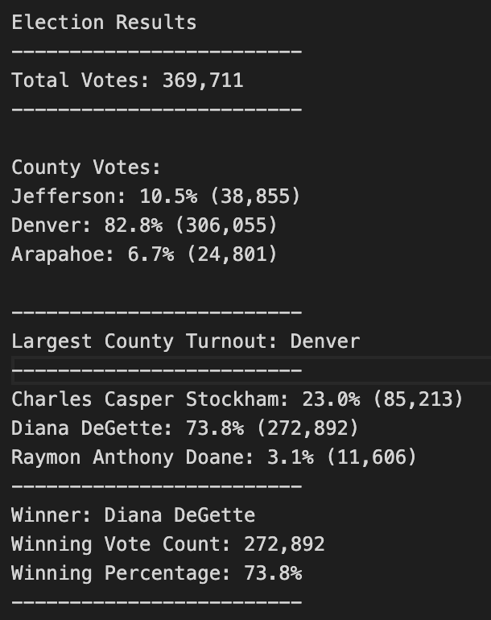

# Election Analysis

## Project Overview
In this project, I was asked by a Colorado Board of Elections employee to complete the election audit of a recent local congressional election. I was given the following tasks to do so.

1. Calculate the total number of votes cast.
2. Get a complete list of candidates who received votes.
3. Calculate the total number of votes each candidate received.
4. Calculate the percentage of votes each candidate won.
5. Determine the winner of the election based on popular vote.

## Resources
- Data Source: election_results.csv
- Software: Python 3.8.6, Visual Studio Code 1.49.3

## Summary
The analysis of the election shows that:
- There were 369,711 votes cast in the election.
- The candidates were:
    - Charles Casper Stockham
    - Diana DeGette
    - Raymon Anthony Doane
- The candidate results were:
    - Charles Casper Stockham received 23.0% of the vote and 85,213 number of votes.
    - Diana DeGette received 73.8% of the vote and 272,892 number of votes.
    - Raymon Anthony Doane received 3.1% of the vote and 11,606 number of votes.
- The winner of the election was:
    - Diana DeGette, who received 73.8% of the vote and 272,892 number of votes.
    
## Challenge Overview
The purpose of this challenge is to add county-specific data to the analysis conducted in the project above. While the initial project consisted of data on each candidate's vote and vote percentage, as well as the election outcome, this addition includes similar statistics for each county. I used congruent methods to calculate the total number of votes in each county, each county's vote percentage, and ultimately the county with the largest voter turnout. 

## Challenge Summary
The continued analysis of the election shows that:
- The county results were:
    - Jefferson had 10.5% of the votes and 38,855 total votes.
    - Denver had 82.8% of the votes and 306,055 total votes.
    - Arapahoe had 6.7% of the votes and 24,801 total votes.
- The county with the largest voter turnout was:
    - Denver, which accounted for 82.8% of the votes (306,055 total votes)
    
The output of the completed program is shown below:

## Election-Audit Summary

